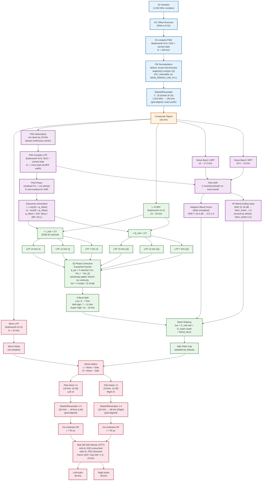
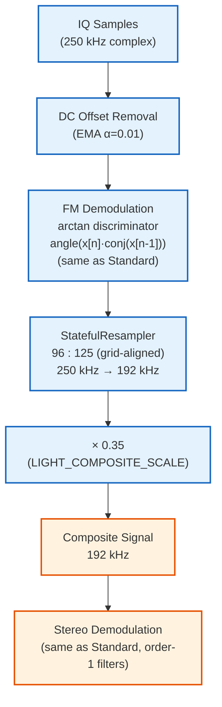

# FM Stereo Demodulation Block Diagram

Reflects the current pipeline (2026-07). The standard demodulator
defaults to an **arctan discriminator** (the legacy PLL path is
retained behind `MAIN_DEMOD_USE_PLL`), the pilot is extracted by a
**phase-continuous heterodyne + complex lowpass** (no FFT Hilbert),
and every resampling / decimation stage is **stateful across blocks**.

## FMDemodulator (Standard)

## FMDemodulatorLight (Arctan Discriminator)

## Signal Rate Summary

| Stage | Rate | Ratio |
|-------|------|-------|
| SDR IQ input (Standard) | 1,024,000 Hz | — |
| SDR IQ input (Light) | 250,000 Hz | — |
| Composite signal | 192,000 Hz | ↓3:16 (Standard) / ↓96:125 (Light) |
| Audio output | 48,000 Hz | ↓1:4 |

All three resampling ratios (3:16, 96:125, 1:4) run through
`StatefulResampler`, which grid-aligns the polyphase phase across
arbitrary block sizes so the streamed output is an exact prefix of a
one-shot `resample_poly`.

## Key Processing Blocks

| Block | Class / Function | File |
|-------|-----------------|------|
| Main FM demod (discriminator / PLL) | `FMDemodulator.process_iq_samples()` | `demodulator.py` |
| Pilot PLL (residual) | `PLL` (return_phase=True) | `pll.py` |
| Resampling (all ratios) | `StatefulResampler` (grid-aligned) | `filters.py` |
| Lowpass / Bandpass / Notch | `LowpassFilter`, `BandpassFilter`, `NotchFilter` | `filters.py` |
| De-emphasis | `DeemphasisIIRFilter` (Numba) | `filters.py` |
| Side-channel NR | `SideNoiseReducer` (DD-Wiener STFT) | `filters.py` |
| Stereo Demod Pipeline | `BaseFMDemodulator._demodulate_stereo()` | `demodulator.py` |
